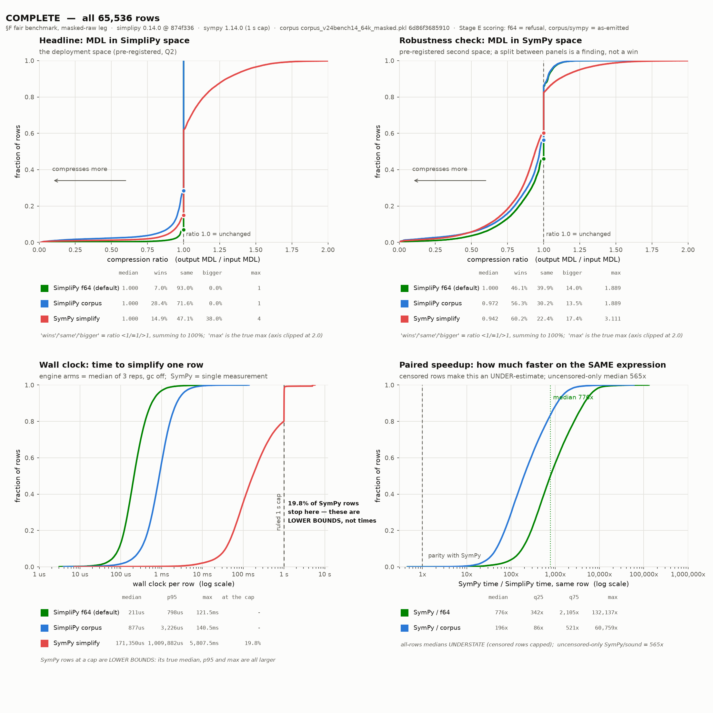

# Simplifying expressions

```python
import simplipy as sp

engine = sp.SimpliPyEngine.load("acj-4-3", install=True)
```

## The pipeline

```text
function simplify(expr, max_passes=48, mode=f64):
    state = canon(parse(expr))            # infix→prefix or validate, then the CANONICAL
                                          # form: flat AC bags, exact rationals, like
                                          # terms collected — this is state ZERO

    loop:                                 # a DETERMINISTIC chain, no search
        next = canon(rewrite_pass(state, mode))   # one rules pass, re-canonicalized
        if next == state: break           # fixpoint
        state = next
    return state                          # μ(state) ≤ μ(state zero): every changed pass
                                          # output strictly descends the well-founded
                                          # reduction ordering, so termination is a
                                          # THEOREM; max_passes and the step cap are
                                          # defence-in-depth, not the mechanism
```

`simplify` is the **equivalence chain only**. Every step — like-term collection inside the
canonical constructors, rule application, and the exact fold — preserves the function almost
everywhere, so the result is sound, never costlier than the input under the engine's
description-length measure μ (the input's canonical form is the first state), and idempotent
at any fixpoint run. **μ is not token count**: on the 400-skeleton
reference corpus, `complexity(simplify(e)) ≤ complexity(e)` holds 400/400, while 77 outputs are
*longer in explicit tokens* than their inputs — 71 at exact μ ties and 6 that are strictly
μ-cheaper yet longer (e.g. μ 163,000 → 155,000 at 22 → 23 tokens: a cheaper literal can take
more tokens to spell). The default *tagged* serialization additionally writes explicit bag
delimiters (`<mul>…</mul>`), so its token count rises more often still (264/400) without any
state change behind it. The guarantee the engine carries is the μ-non-increase, soundness, and
idempotence — never an output-token bound in either serialization.
There is no search, and that is the AC core's whole point. The pre-AC kernel needed a
best‑first tree search because its cancellation was non-confluent — which cancel candidate
fired, and in which order, changed what could fire later. In the AC core, **cancellation IS
canonicalization**: like-term collection in flat bags, computed by one deterministic
function, so there is nothing to branch over. What remains is the deterministic chain above.
Every changed pass output strictly descends the reduction ordering (μ, then the canonical
order), and that ordering is well-founded, so the chain never revisits a state and reaches
its fixpoint in finitely many passes as a theorem; the `max_passes` parameter (default 48)
and the internal step cap are defence-in-depth against ordering-invariant bugs, not part of
the argument. `max_passes` bounds the number of times that `loop` body runs — **passes, not
nodes**: on the 400-skeleton reference corpus the chain converges in 2–4 passes, so the
default of 48 is never reached and the knob is not a performance dial. (It was called
`node_budget` before 0.14, which named the wrong unit; that spelling is removed.)
The full ledger of what is theorem, what is enforced, and what is empirical is
[formal.md](../formal.md).

**Masking is not part of `simplify`.** Relabelling numeric literals to the generic `<constant>`
placeholder is a *representation* step for a downstream model that cannot consume literals, not
an equivalence-preserving rewrite. It is a separate terminal step — see the
[Masking guide](masking.md).

The same call as a flowchart, with the memo state each stage touches drawn as
cylinders (dotted links are lookups/inserts, not data flow):


The compiled core implements ONE engine line, carrying the contract semantics: numeric
constant folding (including non-finite results such as `1/0 -> float("inf")`), the
corrected conversions, and real-semantics power evaluation. Byte-exact reproduction of
historical behavior (the dev_7-3 / v23.0 era) is served by installing `simplipy<=0.6.0`.

## Soundness modes

`simplify(expr, mode=...)` selects a point on an **axis**, not a rung on a ladder.
`simplipy.Mode` has three members: `f64` (the default), `real` and `corpus`.

The axis exists because soundness is two *incomparable* notions, not one ordering. A rewrite
can be true in mathematics and not reproduced by floating point, or reproduced exactly by
floating point and mathematically false:

| rewrite | true over ℝ? | what f64 computes |
|---|---|---|
| `atanh(tanh t) → t` | yes, for every real `t` | `inf` past `t = 18.990341103219276`, where `tanh` attains exactly `1.0` |
| `asin(1e-8) → 1e-8` | no — wrong by the cubic term, `1.667e-25` | bit-identical |

Neither rule is "more sound" than the other, so there is no rung to put them on, and `<`
between modes raises `TypeError`.

- **`Mode.f64`** (the default) is sound as the **deployed f64 evaluator computes**. Use it
  whenever the output will be evaluated in floating point — inference, recovery scoring,
  holdout matching. It is byte-identical to the historical `SOUND`.

- **`Mode.real`** is sound as **mathematics defines**, independent of any float format. Use it
  when a rewrite must hold symbolically — proofs, exact-arithmetic backends, publication — and
  accept that some of what it does is not what f64 will compute.

- **`Mode.corpus`** is the permissive superset, for training-corpus canonicalisation **only**.
  Every rule placeholder binds any subtree (the `!`-certificate is skipped), cancellation drops
  its group-axiom gate, and the constant-fold drops its finiteness gate. It is *not*
  equivalence-preserving. Do not use it on an inference or scoring path: the training data is
  generated *from* the simplified form, so the target equals the data and there is no external
  function to violate.

Each mode names one **distinct, complete** rule set — `rules.json` / `rules_real.json` /
`rules_corpus.json` — so selecting a mode selects a file, and what is loaded is what is served.

```python
from simplipy import Mode

# log(C) is undefined for C <= 0. The default is strict about it; only the permissive
# mode collapses it.
engine.simplify(['exp', 'log', '<constant>'], mode=Mode.f64)     # -> ['exp', 'log', '<constant>']
engine.simplify(['exp', 'log', '<constant>'], mode=Mode.corpus)  # -> ['<constant>']

# A finite-a.e. subtree (pole at a single measure-zero constant) folds in every mode:
engine.simplify(['inv', '<constant>'])                    # -> ['<constant>']   (1/C)
```

`Mode.real` needs the `rules_real.json` that a 0.14.0 mine produces, and **fails closed**
on an artifact without one rather than quietly serving it the f64 set. Against a triple it
shows the two soundnesses disagreeing on a single expression:

<!-- docs-example: skip: needs rules_real.json, which the first 0.14.0 mine produces; the currently published asset predates the triple -->
```python
engine.simplify(['atanh', 'tanh', '30'], mode=Mode.f64)   # -> ['float("inf")']  what f64 computes
engine.simplify(['atanh', 'tanh', '30'], mode=Mode.real)  # -> ['30']            what is true
```

`Mode.SOUND` and `Mode.LOSSY` are removed in 0.14.0; use `Mode.f64` and `Mode.corpus`.
The string spellings `'sound'` and `'lossy'` are removed with them.

### What `f64` mode does and does not promise

It promises that **every rewrite it applies** is one the deployed evaluator agrees with, to
within a derived bound of 8 ULP (`simplipy.verify._contract.REALISED_ULP`), which comes
from the measured worst-case error of the platform's own math library rather than from a
chosen tolerance.

It does **not** promise to preserve your evaluation order. The canonical form flattens sums
and products into bags and re-emits them, and IEEE-754 addition commutes but does not
associate:

```python
engine.simplify(['+', '+', 'x0', 'x1', 'x2'])   # -> ['+', 'x0', '+', 'x1', 'x2']
# at x0=1e16, x1=-1e16, x2=1 the input evaluates to 1.0 and the output to 0.0
```

The association is deterministic — the same input always gives the same output — and for
expressions that are well-conditioned in f64 the value is preserved. For ill-conditioned ones
it may not be. This is the standard position for any AC-normalising simplifier, and it is
stated here rather than left to be discovered.

**Why two modes, and how flash-ansr uses them.** The downstream trainer
([flash-ansr](https://github.com/psaegert/flash-ansr), a transformer for symbolic regression)
uses each mode on a different side of its pipeline:

- **Training-data generation uses `Mode.corpus`.** A skeleton is corpus-simplified and the numeric
  data is then generated *from that simplified form* — so the target the model learns and the data
  it is trained on are the *same* expression (`target == data`). There is no external ground-truth
  function for `corpus` to violate, so the aggressive reductions are safe here and they give the model
  the shortest, most canonical target. (An `exp(log(<constant>))` that survives cancellation, for
  instance, becomes a plain `<constant>`, which is what the generated data reflects.)

- **Inference and recovery scoring use `Mode.f64`.** At test time the data comes from an unknown
  true function; the predicted skeleton must be simplified *without* changing what it computes, or
  the fit and the score would drift, and the data is evaluated in floating point -- which is
  exactly the soundness `f64` preserves.

That split is the whole reason the permissive mode exists: `corpus` maximizes canonicalization where the
simplified form *defines* the data, and `f64` preserves what the evaluator computes where
it must not change.

## Key components

- **Parsing & normalization** – `SimpliPyEngine.parse` and
	`SimpliPyEngine.convert_expression` convert infix input, harmonize power
	operators, and propagate unary negation without losing prefix fidelity.
- **Canonicalization (cancellation lives here)** – the canonical constructors keep
	every associative-commutative operator as a flat bag with exact rational
	arithmetic and collect like terms as they build, so opposite-parity subtrees and
	redundant factors cancel *by construction*, before and between rule passes, and
	identical expressions share identical layouts under the stable canonical order.
- **Rule execution** – `SimpliPyEngine.compile_rules` syncs machine-discovered or
	human-authored simplifications into the compiled core, which performs fast
	top-down, first-match-wins rewriting in each pass.
- **Rule discovery workflow** – `SimpliPyEngine.find_rules` explores expression
	space natively on the compiled core (parallelized across all cores via rayon),
	confirms identities with numeric sampling, and writes back deduplicated
	rulesets that future engines can load instantly.

## Normalization helpers

Besides the engine, SimpliPy exports the two canonical expression FORMS at the
package root: `to_skeleton`, `to_expression`, and the single-token helper
`normalize_variable_token` (also available as `simplipy.normalization`). They
canonicalize an expression so that two expressions that are "the same" up to
variable renaming / constant values compare equal, giving downstream consumers
(holdout matching, symbolic-recovery scoring) identical behavior by construction.
Each takes all three forms (infix `str`, explicit prefix, tagged) and returns the
one it was given; the canonicalization runs through the engine's internal state,
so the answer does not depend on the dialect you passed.

```python
import simplipy as sp

# Skeleton form: variables -> x{n}, EVERY numeric literal -> <constant>
sp.to_skeleton(['+', 'v1', '2.5'], engine)
# -> ['+', 'x1', '<constant>']

# Expression form: variables canonicalized, numeric values kept
sp.to_expression(['+', 'V1', '3'], engine)
# -> ['+', 'x1', '3']

# Classify / canonicalize a single token -> (normalized_token, is_variable)
sp.normalize_variable_token('X3')
# -> ('x3', True)
sp.normalize_variable_token('sin')
# -> ('sin', False)
```

See the [Normalization](../api.md#normalization) API reference for details.

## Performance

As of `0.3.0` the inline phase (`simplify`, conversions, validation) runs in a compiled Rust
extension (`simplipy._core`), a large speed-up over the previous pure-Python engine at identical
simplification behaviour.

0.6.0 reworks the match-time economics at byte-identical outputs: `!`-sort certificates
are evaluated only after a completed syntactic match (instead of per candidate
attempt), memoized per call and in a generational per-engine cache that never stops
memoizing, the fixpoint loop memoizes whole passes and rule-normal subtrees, and the
hot path runs on interned token ids (~20× fewer allocations per call). On a
65,536-expression training-prior benchmark, large certificate-bearing rulesets run
~59× faster than 0.5.0; certificate-free rulesets run ~2.3× faster.

Since 0.7.0 there is a single compiled engine line, and the published ruleset artifacts
(`2-1`, `3-2`, `4-3`, …) are the distinguishing factor between engines. Rule application
always considers every pattern in the loaded artifact (the former `max_pattern_length`
knob was removed in 0.10.0).

The 0.13 line ships a re-designed, pre-registered fair benchmark: serial
single-core for every arm, paired per-row scoring against SymPy 1.13.1
(1 s cap, censoring stated on the panel), three corpora — an SR training
prior (n = 65,536), its raw-masked transform (n = 65,536), and an
external neutral problem set (n = 528). Scored in the deployment space
under the MDL measure, with bootstrap 95% CIs; ratio = output/input, lower
is better; "made bigger" = the fraction of rows an arm inflated.

| corpus | arm | mean ratio | wins | made bigger |
|---|---|---|---|---|
| SR prior, unmasked | simplipy sound | **0.964** | 9.1% | **0.0%** |
| | sympy simplify | 1.081 | 17.2% | 41.6% |
| SR prior, masked raw | simplipy sound | **0.982** | **18.7%** | **0.0%** |
| | sympy simplify | 1.072 | 17.1% | 40.4% |
| external set | simplipy sound | 0.999 | 1.3% | **0.0%** |
| | sympy simplify | 1.023 | 19.1% | 19.3% |

The sound engine never inflated a single row of 131,600: refusal semantics
mean an unprovable rewrite returns the input unchanged. SymPy's `simplify`
inflates roughly four rows in ten on SR-shaped corpora and hits its 1 s
timeout on ~14% of raw-masked rows. Paired wall-clock on the same rows:
median speedup **~780×** (masked raw) / ~600–800× across corpora, medians
at 92–130 µs per row against SymPy's ~69 ms. On the external set both
systems are near the fixpoint; SymPy's 19.1% wins there are dominated by
number-respelling (floats rewritten as exact rationals), not structural
simplification.



Full panels: [unmasked](../assets/benchmarks/ecdf_unmasked.png) ·
[masked raw](../assets/benchmarks/ecdf_masked_raw.png) ·
[external](../assets/benchmarks/ecdf_external.png)
