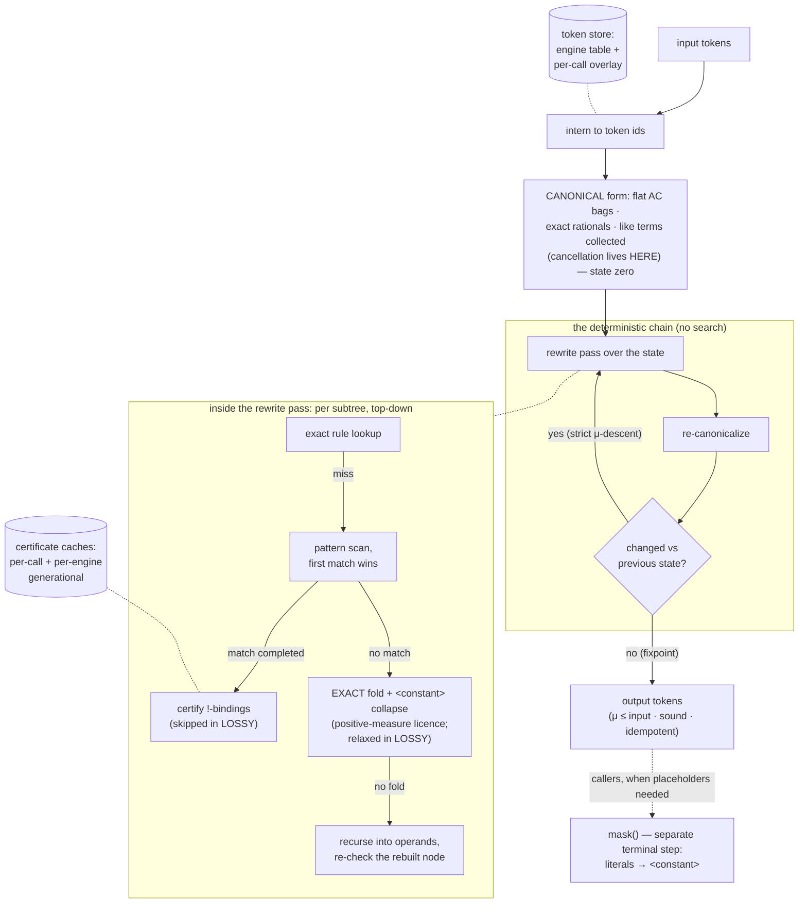

# Simplifying expressions

```python
import simplipy as sp

engine = sp.SimpliPyEngine.load("acj-4-3", install=True)
```

## The pipeline

```text
function simplify(expr, node_budget=48, mode=SOUND):
    state = canon(parse(expr))            # infix→prefix or validate, then the CANONICAL
                                          # form: flat AC bags, exact rationals, like
                                          # terms collected — this is state ZERO

    loop:                                 # a DETERMINISTIC chain, no search
        next = canon(rewrite_pass(state, mode))   # one rules pass, re-canonicalized
        if next == state: break           # fixpoint
        state = next
    return state                          # μ(state) ≤ μ(state zero): every changed pass
                                          # output strictly descends the well-founded
                                          # reduction ordering, so termination is a
                                          # THEOREM; node_budget and the step cap are
                                          # defence-in-depth, not the mechanism
```

`simplify` is the **equivalence chain only**. Every step — like-term collection inside the
canonical constructors, rule application, and the exact fold — preserves the function almost
everywhere, so the result is sound, never costlier than the input under the engine's
description-length measure μ (the input's canonical form is the first state), and idempotent
at any fixpoint run. **μ is not token count**: on the 400-skeleton
reference corpus, `complexity(simplify(e)) ≤ complexity(e)` holds 400/400, while 77 outputs are
*longer in explicit tokens* than their inputs — 71 at exact μ ties and 6 that are strictly
μ-cheaper yet longer (e.g. μ 162,000 → 154,000 at 22 → 23 tokens: a cheaper literal can take
more tokens to spell). The default *tagged* serialization additionally writes explicit bag
delimiters (`<mul>…</mul>`), so its token count rises more often still (264/400) without any
state change behind it. The guarantee the engine carries is the μ-non-increase, soundness, and
idempotence — never an output-token bound in either serialization.
There is no search, and that is the AC core's whole point. The pre-AC kernel needed a
best‑first tree search because its cancellation was non-confluent — which cancel candidate
fired, and in which order, changed what could fire later. In the AC core, **cancellation IS
canonicalization**: like-term collection in flat bags, computed by one deterministic
function, so there is nothing to branch over. What remains is the deterministic chain above.
Every changed pass output strictly descends the reduction ordering (μ, then the canonical
order), and that ordering is well-founded, so the chain never revisits a state and reaches
its fixpoint in finitely many passes as a theorem; the `node_budget` parameter (default 48)
and the internal step cap are defence-in-depth against ordering-invariant bugs, not part of
the argument. The full ledger of what is theorem, what is enforced, and what is empirical is
[formal.md](../formal.md).

**Masking is not part of `simplify`.** Relabelling numeric literals to the generic `<constant>`
placeholder is a *representation* step for a downstream model that cannot consume literals, not
an equivalence-preserving rewrite. It is a separate terminal step — see the
[Masking guide](masking.md).

The same call as a flowchart, with the memo state each stage touches drawn as
cylinders (dotted links are lookups/inserts, not data flow):



The compiled core implements ONE engine line, carrying the contract semantics: numeric
constant folding (including non-finite results such as `1/0 -> float("inf")`), the
corrected conversions, and real-semantics power evaluation. Byte-exact reproduction of
historical behavior (the dev_7-3 / v23.0 era) is served by installing `simplipy<=0.6.0`.

## Soundness modes

`simplify(expr, mode=...)` selects a point on a single ordinal soundness axis, `simplipy.Mode`.
Two rungs are implemented; `EXACT` and `AE` are reserved positions in the decided
`EXACT ≤ SOUND ≤ AE ≤ LOSSY` ordering.

- **`Mode.SOUND`** (the default) is equivalence-preserving and idempotent. Every rewrite edge
  carries a soundness gate: rules only bind a composite subtree that a match-time certificate
  proves defined-and-finite almost everywhere (the `!`-sort); cancellation only cancels leaves
  where the group axioms hold; and the constant-fold collapses a subtree to a free `<constant>`
  only when its value is finite on a positive-measure set of its constants. This is the mode to
  use whenever the output is scored against data from an unknown function (inference, recovery
  scoring, holdout matching).

- **`Mode.LOSSY`** relaxes *all three* gates together — every rule placeholder binds any subtree
  (`!`-certificate skipped), cancellation drops its group-axiom gate, and the constant-fold drops
  its finiteness gate. It only ever binds *more*, so it recovers reductions the sound line leaves
  on the table, at the cost of firing off the certified domain (pole/`inf`/`nan`-bearing
  cofactors). It is **not** equivalence-preserving.

```python
from simplipy import Mode

# log(C) is undefined for C <= 0: SOUND keeps the composition, LOSSY collapses it.
engine.simplify(['exp', 'log', '<constant>'], mode=Mode.SOUND)  # -> ['exp', 'log', '<constant>']
engine.simplify(['exp', 'log', '<constant>'], mode=Mode.LOSSY)  # -> ['<constant>']

# (x^2)^0.5 equals |x|, not x: SOUND refuses the flattening, LOSSY takes it.
engine.simplify(['pow', 'pow', 'x0', '2', '0.5'], mode=Mode.SOUND)  # -> unchanged
engine.simplify(['pow', 'pow', 'x0', '2', '0.5'], mode=Mode.LOSSY)  # -> ['x0']

# A finite-a.e. subtree (pole at a single measure-zero constant) folds in BOTH modes:
engine.simplify(['inv', '<constant>'])                       # -> ['<constant>']   (1/C)
```

**Why two modes, and how flash-ansr uses them.** The downstream trainer
([flash-ansr](https://github.com/psaegert/flash-ansr), a transformer for symbolic regression)
uses each mode on a different side of its pipeline:

- **Training-data generation uses `Mode.LOSSY`.** A skeleton is lossy-simplified and the numeric
  data is then generated *from that simplified form* — so the target the model learns and the data
  it is trained on are the *same* expression (`target == data`). There is no external ground-truth
  function for LOSSY to violate, so the aggressive reductions are safe here and they give the model
  the shortest, most canonical target. (An `exp(log(<constant>))` that survives cancellation, for
  instance, becomes a plain `<constant>`, which is what the generated data reflects.)

- **Inference and recovery scoring use `Mode.SOUND`.** At test time the data comes from an unknown
  true function; the predicted skeleton must be simplified *without* changing what it computes, or
  the fit and the score would drift. Only the equivalence-preserving mode is safe there.

That split is the whole reason both modes exist: LOSSY maximizes canonicalization where the
simplified form *defines* the data, and SOUND guarantees equivalence where it must not.

## Key components

- **Parsing & normalization** – `SimpliPyEngine.parse` and
	`SimpliPyEngine.convert_expression` convert infix input, harmonize power
	operators, and propagate unary negation without losing prefix fidelity.
- **Canonicalization (cancellation lives here)** – the canonical constructors keep
	every associative-commutative operator as a flat bag with exact rational
	arithmetic and collect like terms as they build, so opposite-parity subtrees and
	redundant factors cancel *by construction*, before and between rule passes, and
	identical expressions share identical layouts under the stable canonical order.
- **Rule execution** – `SimpliPyEngine.compile_rules` syncs machine-discovered or
	human-authored simplifications into the compiled core, which performs fast
	top-down, first-match-wins rewriting in each pass.
- **Rule discovery workflow** – `SimpliPyEngine.find_rules` explores expression
	space natively on the compiled core (parallelized across all cores via rayon),
	confirms identities with numeric sampling, and writes back deduplicated
	rulesets that future engines can load instantly.

## Normalization helpers

Besides the engine, SimpliPy exports pure-string normalization helpers at the
package root: `normalize_skeleton`, `normalize_expression`, and
`normalize_variable_token` (also available as `simplipy.normalization`). They
canonicalize a prefix token sequence so that two expressions that are "the same"
up to variable renaming / constant values compare equal, giving downstream
consumers (holdout matching, symbolic-recovery scoring) identical behavior by
construction.

```python
import simplipy as sp

# Skeleton form: variables -> x{n}, numeric literals -> <constant>
sp.normalize_skeleton(['+', 'v1', '2.5'])
# -> ['+', 'x1', '<constant>']

# Expression form: variables canonicalized, numeric literals kept intact
sp.normalize_expression(['+', 'V1', '2.5'])
# -> ['+', 'x1', '2.5']

# Classify / canonicalize a single token -> (normalized_token, is_variable)
sp.normalize_variable_token('X3')
# -> ('x3', True)
sp.normalize_variable_token('sin')
# -> ('sin', False)
```

See the [Normalization](../api.md#normalization) API reference for details.

## Performance

As of `0.3.0` the inline phase (`simplify`, conversions, validation) runs in a compiled Rust
extension (`simplipy._core`), a large speed-up over the previous pure-Python engine at identical
simplification behaviour.

0.6.0 reworks the match-time economics at byte-identical outputs: `!`-sort certificates
are evaluated only after a completed syntactic match (instead of per candidate
attempt), memoized per call and in a generational per-engine cache that never stops
memoizing, the fixpoint loop memoizes whole passes and rule-normal subtrees, and the
hot path runs on interned token ids (~20× fewer allocations per call). On a
65,536-expression training-prior benchmark, large certificate-bearing rulesets run
~59× faster than 0.5.0; certificate-free rulesets run ~2.3× faster.

Since 0.7.0 there is a single compiled engine line, and the published ruleset artifacts
(`2-1`, `3-2`, `4-3`, …) are the distinguishing factor between engines. Rule application
always considers every pattern in the loaded artifact (the former `max_pattern_length`
knob was removed in 0.10.0).

The 0.13 line ships a re-designed, pre-registered fair benchmark: serial
single-core for every arm, paired per-row scoring, right-censoring stated
on the panel, three corpora (an SR training prior, its raw-masked
transform, and an external neutral-prior set). Results ledgers and ECDF
figures: coming soon.
