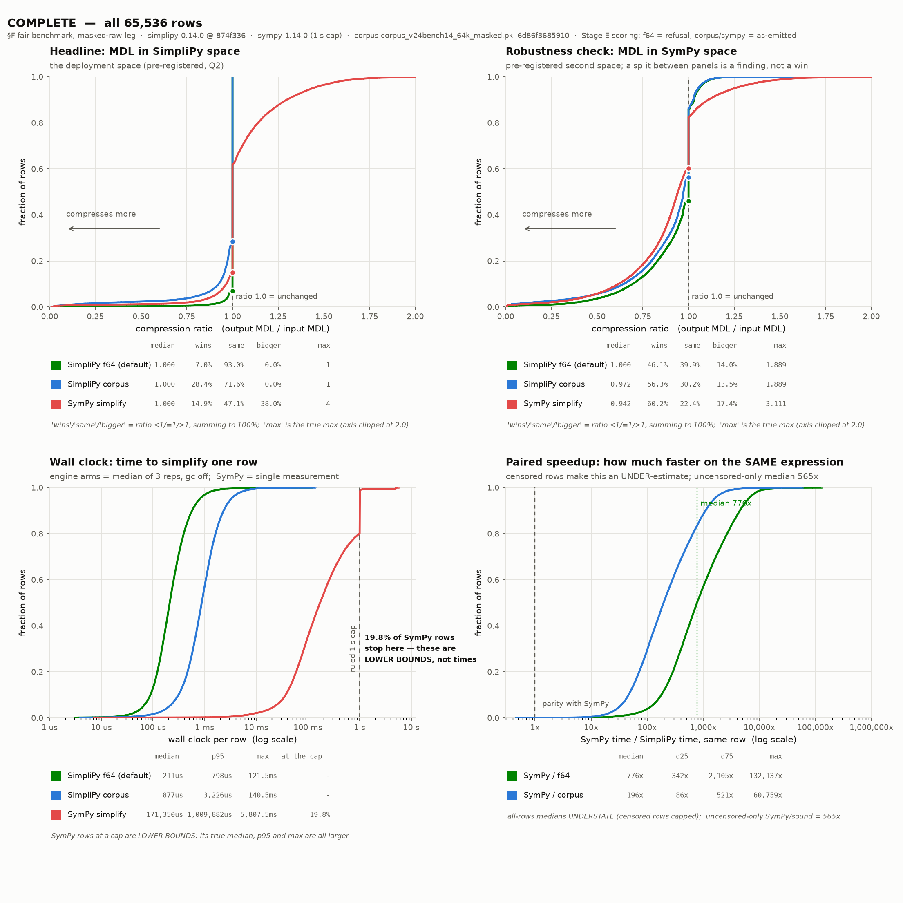

# Simplifying expressions

```python
import simplipy as sp

engine = sp.SimpliPyEngine.load("acj-5-4-llm", install=True)
```

## The pipeline

```text
function simplify(expr, max_passes=48, mode=f64, effort=DEFAULT_EFFORT):
    state = canon(parse(expr))            # infix→prefix or validate, then the CANONICAL
                                          # form: flat AC bags, exact rationals, like
                                          # terms collected — this is state ZERO

    loop:                                 # a DETERMINISTIC chain, no search
        next = canon(rewrite_pass(state, mode))   # one rules pass, re-canonicalized
        if next == state: break           # fixpoint
        state = next
    return state                          # μ(state) ≤ μ(state zero): every changed pass
                                          # output strictly descends the well-founded
                                          # reduction ordering, so termination is a
                                          # THEOREM; max_passes and the step cap are
                                          # defence-in-depth, not the mechanism
```

Every step preserves the function almost everywhere: like-term collection inside the
canonical constructors, rule application, and the exact fold. The result is therefore
sound, never costlier than the input in the measure the chain itself descends — each
mode's own canonical pricing — and idempotent at any fixpoint run. `complexity(e,
mode=m)` is that measure: each mode reads an expression into its own canonical form,
because the modes accept different simplifications as true (`f64` follows the float
evaluator, so `1/exp(5132.3)` is `0`; `real` follows exact arithmetic, so it is not;
`permissive` also moves constants to their floats), and prices that form. So
`complexity(simplify(e, mode=m), mode=m) ≤ complexity(e, mode=m)` in every mode, and
prices of different modes are prices of different readings, not comparable across
modes. Two *different spellings* of the same value may still settle at different
fixpoints; each obeys its own bound.

The chain itself does not search: **cancellation IS canonicalization** — like-term
collection in flat bags, computed by one deterministic function, so inside a pass there
is nothing to branch over. Every changed pass output strictly descends the reduction
ordering (μ, then the canonical order), and that ordering is well-founded, so the chain
never revisits a state and reaches its fixpoint in finitely many passes as a theorem;
the `max_passes` parameter (default 48) and the internal step cap are defence-in-depth
against ordering-invariant bugs, not part of the argument. `max_passes` bounds the
number of times that `loop` body runs — **passes, not nodes**: on the 400-skeleton
reference corpus the chain converges in 2–4 passes, so the default of 48 is never
reached and the knob is not a performance dial. What strict descent alone cannot do —
pass through a state that prices *higher* on the way to a cheaper one — is the job of
the [search budget](#the-search-budget) below.
The full ledger of what is theorem, what is enforced, and what is empirical is
[formal.md](../formal.md).

**Masking is part of the same machinery.** Relabelling numeric literals to the generic
`<constant>` placeholder is a *representation* step for a downstream model that cannot
consume literals, and which literals to abstract is the caller's policy, so it is its own
call, `mask()`, never a side effect of `simplify` (see the [Masking guide](masking.md)).
It is not outside the engine, though: `<constant>` is a first-class token inside
`simplify` — rules bind it, and the exact fold collapses constant subtrees into it under
the positive-measure licence — and `mask()`'s collect stage is itself a `simplify` call
over the substituted tokens, which is what enforces one `<constant>` per degree of
freedom (`2*x0/3` is one free value, not two).

The same call as one procedure, with the memo state each stage touches noted where
it applies:

1. **Intern** the input tokens to token ids (the token store: the engine table plus a
   per-call overlay).
2. **Canonicalize** into state zero: flat AC bags, exact rationals, like terms
   collected. Cancellation lives here.
3. **Loop** — one rewrite pass over the state, then re-canonicalize; stop at the first
   pass that changes nothing (the fixpoint). Every changed pass output is strictly
   below its predecessor in the reduction ordering. Inside the pass, per subtree,
   top-down:
    1. exact rule lookup; on a miss, the pattern scan, first match wins;
    2. a match that binds wide slots must pass the bind-time `!`/`$` certificates
       (skipped in permissive mode); verdicts are memoized per call and in a
       generational per-engine cache;
    3. no match: the exact fold with the `<constant>` collapse (positive-measure
       licence; relaxed in permissive mode);
    4. still nothing: recurse into the operands and re-check the rebuilt node.
4. **Serialize** back out: μ ≤ input, sound, idempotent. Callers that need
   placeholders then run `mask()` — the separate call above.

The compiled core implements one engine line: numeric constant folding (including
non-finite results such as `1/0 -> float("inf")`) and real-semantics power evaluation.

## The search budget

Strict descent cannot cross a μ-hill. `x2*(x2 + (x1+1)/x2)` reaches the strictly
cheaper `1 + x1 + x2**2` only by distributing first — which prices *higher* at that
node — and recollecting after, so the chain above, which only ever takes descending
steps, never finds that valley. The search budget exists for exactly this class.

With a budget, the chain first runs unchanged to its fixpoint. An exploration
phase then proposes expansion moves the descent refuses — distributing a product over
its sums, expanding an integer power of a sum — runs every candidate through the same
certified constructors and the same descent loop, and replaces the incumbent only when
the candidate's endpoint lands strictly below it in the engine's one reduction
ordering. Acceptance is that ordering test and nothing else; no new measure or
tolerance enters.

The budget is the `effort` parameter. The default, `effort=None`
(`simplipy.DEFAULT_EFFORT`), searches until a round finds nothing, so a second call
has nothing left to continue (the residual classes follow below). `simplify(expr, effort=64)` caps each search at 64 candidate
descents (`permissive` runs several per call), and `effort=0` never enters the phase — byte-identical to the chain alone. Pass
`effort=0` on throughput-critical paths.

A cap counts every candidate tried, refused ones included, over the whole expression, so
the cap a search needs grows with the expression: one of srbf's model predictions needs 8
candidates to reach its uncapped answer, a sum of two copies of it 13, of three 19 and of
eight 39, so no fixed cap is enough. With the old default cap of 4, 2,701 of srbf's 125,127
model predictions change on a second call in `f64` (2,673 to a cheaper form), because the
first call stopped between two improvements. Uncapped, 26 do, at equal price but one: 23 also
change with the search off (long expressions, all but one of them products, whose factors
re-read in another order or sign), and 3 are long products of that kind that only the search
reaches — the search can reach a state of the residual classes of `docs/formal.md` (I3) that
the chain alone never visits. No answer is costlier than at cap 4 and 2,888 are cheaper; in
`real`, 2,703 change at cap 4 and the same 26 uncapped.
The search runs in two phases. For its first 8 candidates it is the capped default's
breadth-first search: every candidate of every accepted state, against the best so far; on
srbf's predictions that alone gives the final answer on 124,572 of the 125,127 in `f64` and
`real`. If it has not settled by then, it steps from the best answer to the first of its
candidates that is cheaper, resuming where the last improvement happened, until a whole round
of the best answer's candidates finds nothing; on the other 555 that saves a median of 58
bits. A breadth-first search re-tries every candidate of every accepted state, which on a
large sum of terms that each need several expansions grows with the square of the number of
terms; on 16 copies of one prediction the two-phase search takes about six times as long as
`effort=4`, for an answer a third of the price. On srbf's predictions it takes 8% more time
than `effort=4` in every mode. Every internal caller that passes no
`effort` (normalization, masking, mining, the verification monitor, the promotion refund)
follows the default.

`permissive` runs three arms (its two fold disciplines and the `f64` chain) and returns the
cheapest of its candidates, each priced as it is returned — what it prints, re-read in
`permissive`'s own measure: every state its arms can end on under some budget (a capped run is
the same walk cut short), the `f64` arm's states finished in `permissive` where they read
cheaper than `permissive`'s own fixpoints, the literal-fold continuation of every capped run's
winner, and the input as read. So its answer never prices above the input, above its answer
with the search off, or above its answer at a smaller `effort`; on flash-ansr's T8.1 draws,
srbf's ground truths and its predictions none does. A second call can still improve on it
through another arm: 32 of the 129,490 T8.1 answers and 33 of srbf's 125,127 predictions
change on a second call.

What the search buys, on the 129,490 simplify inputs of flash-ansr's T8.1 training draws
(output price over input price, `complexity(.., mode=m)`): in `f64` it moves the mean ratio from 0.979
with the search off to 0.976 and lifts the strictly simplified answers from 6.0% to 9.2%, for
about 28% more median time per call; in `permissive` (in its own measure) from 0.960 to 0.954
and from 21.9% to 28.2%, for about 50% more.

Every guarantee above survives any budget: candidates are built under the same
certificates (soundness), the incumbent is only ever replaced by something strictly
below it (the result is never worse than the fixpoint, hence never costlier than the
input; in `permissive` for its selection too), both
phases move only on strict descent of a well-founded ordering
(termination, independent of the budget), and the walk order is deterministic
(reproducibility). Idempotence needs the search to run until a round finds nothing,
the default: a cap can stop it between two improvements, which a second call then
continues.

## Soundness modes

`simplify(expr, mode=...)` selects a point on an **axis**, not a rung on a ladder.
`simplipy.Mode` has three members: `f64` (the default), `real` and `permissive`.

The axis exists because soundness is two *incomparable* notions, not one ordering. A rewrite
can be true in mathematics and not reproduced by floating point, or reproduced exactly by
floating point and mathematically false:

| rewrite | true over ℝ? | what f64 computes |
|---|---|---|
| `atanh(tanh t) → t` | yes, for every real `t` | `inf` once `tanh t` rounds to exactly `1.0` — from `t ≈ 19.06` on the release host; the exact threshold is libm-dependent |
| `asin(1e-8) → 1e-8` | no — wrong by the cubic term, `1.667e-25` | bit-identical |

Neither rule is "more sound" than the other, so there is no rung to put them on, and `<`
between modes raises `TypeError`.

- **`Mode.f64`** (the default) is sound as the deployed f64 evaluator computes. Use it
  whenever the output will be evaluated in floating point.

- **`Mode.real`** is sound as mathematics defines, independent of any float format. Use it
  when a rewrite must hold symbolically.

- **`Mode.permissive`** is the permissive superset, for training-corpus canonicalisation ("beautification").
  Every rule placeholder binds any subtree (the `!`-certificate is skipped), cancellation drops
  its group-axiom gate, the constant-fold drops its finiteness gate, and an exact literal whose
  fraction prices above the shortest float spelling of its value folds to that float (the
  quotient of two 16-digit decimals becomes `0.46867105279529636` instead of a 60-digit
  fraction; `1/2` and `15/37` stay, being cheaper as fractions). It is *not*
  equivalence-preserving. Do not use it on an inference or scoring path: the training data is
  generated *from* the simplified form, so the target equals the data and there is no external
  function to violate.

### How numbers are printed

Every literal is its exact rational value: `3.141592653589793` is 3141592653589793 / 10^15,
and folding is exact arithmetic. A value whose denominator has a prime factor other than 2
and 5 has no finite decimal, so `1/(2*3.141592653589793)` is the fraction
500000000000000 / 3141592653589793. A decimal is just as exact as an integer, though, so
the infix answer prints such a value with its numerator's factors 2 and 5 moved into the
denominator, which then terminates. That spelling needs a factor 2 or 5 in the numerator and
is used where it is shorter than the two integers, outside exponents: short fractions such as
`1/3` keep theirs, and an exponent keeps the fraction
(`x0^(500000000000000/3141592653589793)`). It is the same value either way, so the state,
`complexity()` and every rewrite are unaffected:

```python
engine.simplify('1/(2*3.141592653589793)')               # -> '1/6.283185307179586'
engine.simplify('3*x0/(20*3.141592653589793)')           # -> '3*x0/62.83185307179586'
engine.simplify('x0*rootn(1/(2*3.141592653589793), 2)')  # -> 'x0*rootn(1/6.283185307179586, 2)'
engine.simplify('5/8')                                   # -> '5/8'
```

The token answers keep the fraction (explicit `['/', '500000000000000', '3141592653589793']`,
tagged `['500000000000000/3141592653589793']`): the engine prints states as tokens and reads
them back, and callers mask and compare token
answers, so one fixed spelling serves them.

Each mode names one **distinct, complete** rule set — `rules_f64.json` / `rules_real.json` /
`rules_permissive.json` (artifacts published before the rename, acj-4 among them, call the f64
file `rules.json`) — so selecting a mode selects a file, and what is loaded is what is served.

```python
from simplipy import Mode

# log(C) is undefined for C <= 0. The default is strict about it; only the permissive
# mode collapses it.
engine.simplify('exp(log(<constant>))', mode=Mode.f64)     # -> 'exp(log(<constant>))'
engine.simplify('exp(log(<constant>))', mode=Mode.permissive)  # -> '<constant>'

# sqrt(x^2) is |x| over the reals -- but rewriting to abs(x) is value-changing in f64
# (sqrt(fl(x^2)) crosses ULP boundaries, and x^2 overflows to inf beyond ~1.3e154), so
# the strict modes refuse, and the permissive mode takes the sign-ignoring algebraic
# collapse instead:
engine.simplify('rootn(x0^2, 2)')                          # -> unchanged
engine.simplify('rootn(x0^2, 2)', mode=Mode.permissive)    # -> 'x0'

# A finite-a.e. subtree (pole at a single measure-zero constant) folds in every mode:
engine.simplify('1/<constant>')                            # -> '<constant>'
```

`Mode.real` needs a `rules_real.json`, and **fails closed** on an artifact without one
rather than quietly serving it the f64 set. Against the shipped triple it shows the two
soundnesses disagreeing on a single expression:

```python
engine.simplify('atanh(tanh(30))', mode=Mode.f64)   # -> 'inf'   what f64 computes
engine.simplify('atanh(tanh(30))', mode=Mode.real)  # -> '30'    what is true
```


### What `f64` mode does and does not promise

It promises that **every rule it applies** has been checked against the deployed evaluator
itself. Both sides of the rewrite are evaluated in floating point across the verifier's
battery and grid, and a rule enters the `f64` set only where they agree to within 8 ULP. That bound is derived rather than chosen: a
rewrite has two sides, each a composition of up to four implementation-defined library
calls whose errors are independent and can oppose.

It does **not** promise that a *sequence* of rewrites carries the same bound. Each rule
carries it individually; simplification composes rules, and floating-point error composes
with them.

It does **not** promise to preserve your evaluation order. The canonical form flattens sums
and products into bags and re-emits them, and IEEE-754 addition commutes but does not
associate:

```python
engine.simplify(['+', '+', 'x0', 'x1', 'x2'])   # -> ['+', 'x0', '+', 'x1', 'x2']
# at x0=1e16, x1=-1e16, x2=1 the input evaluates to 1.0 and the output to 0.0
```

The association is deterministic — the same input always gives the same output — and for
expressions that are well-conditioned in f64 the value is preserved. For ill-conditioned ones
it may not be. This is the standard position for any AC-normalising simplifier, and it is
stated here rather than left to be discovered.

**Why two modes, and how flash-ansr uses them.** The downstream trainer
([flash-ansr](https://github.com/psaegert/flash-ansr), a transformer for symbolic regression)
uses each mode on a different side of its pipeline:

- **Training-data generation uses `Mode.permissive`.** A skeleton is permissive-simplified and the numeric
  data is then generated *from that simplified form* — so the target the model learns and the data
  it is trained on are the *same* expression (`target == data`). There is no external ground-truth
  function for `permissive` to violate, so the aggressive reductions are safe here and they give the model
  the shortest, most canonical target. (An `exp(log(<constant>))` that survives cancellation, for
  instance, becomes a plain `<constant>`, which is what the generated data reflects.)

- **Inference and recovery scoring use `Mode.f64`.** At test time the data comes from an unknown
  true function; the predicted skeleton must be simplified *without* changing what it computes, or
  the fit and the score would drift, and the data is evaluated in floating point -- which is
  exactly the soundness `f64` preserves.

That split is the whole reason the permissive mode exists: `permissive` maximizes canonicalization where the
simplified form *defines* the data, and `f64` preserves what the evaluator computes where
it must not change.

## Key components

- **Parsing & normalization** – `SimpliPyEngine.read_infix` and
	`SimpliPyEngine.convert_expression` convert infix input, harmonize power
	operators, and propagate unary negation without losing prefix fidelity.
- **Canonicalization (cancellation lives here)** – the canonical constructors keep
	every associative-commutative operator as a flat bag with exact rational
	arithmetic and collect like terms as they build, so opposite-parity subtrees and
	redundant factors cancel *by construction*, before and between rule passes, and
	identical expressions share identical layouts under the stable canonical order.
- **Rule execution** – `SimpliPyEngine.compile_rules` syncs machine-discovered or
	human-authored simplifications into the compiled core, which performs fast
	top-down, first-match-wins rewriting in each pass.
- **Rule discovery workflow** – `SimpliPyEngine.find_rules` explores expression
	space natively on the compiled core (parallelized across all cores via rayon),
	confirms identities with numeric sampling, and writes back deduplicated
	rulesets that future engines can load instantly.

## Normalization helpers

Besides the engine, SimpliPy exports the two canonical expression FORMS at the
package root: `to_skeleton`, `to_expression`, and the single-token helper
`normalize_variable_token` (also available as `simplipy.normalization`). They
canonicalize an expression so that two expressions that are "the same" up to
variable renaming / constant values compare equal, giving downstream consumers
(holdout matching, symbolic-recovery scoring) identical behavior by construction.
Each takes all three forms (infix `str`, explicit prefix, tagged) and returns the
one it was given; the canonicalization runs through the engine's internal state,
so the answer does not depend on the dialect you passed.

```python
import simplipy as sp

# Skeleton form: variables -> x{n}, EVERY numeric literal -> <constant>
sp.to_skeleton(['+', 'v1', '2.5'], engine)
# -> ['+', 'x1', '<constant>']

# Expression form: variables canonicalized, numeric values kept
sp.to_expression(['+', 'V1', '3'], engine)
# -> ['+', 'x1', '3']

# Classify / canonicalize a single token -> (normalized_token, is_variable)
sp.normalize_variable_token('X3')
# -> ('x3', True)
sp.normalize_variable_token('sin')
# -> ('sin', False)
```

See the [Normalization](../api.md#normalization) API reference for details.

## Performance

The inline phase (`simplify`, conversions, validation) runs in a compiled Rust extension
(`simplipy._core`) on interned token ids. `!`-sort certificates are memoized —
per call, and in a generational per-engine cache — so repeated match attempts cost
nothing, and the fixpoint loop memoizes whole passes and rule-normal subtrees. There is one compiled
engine line; the published ruleset artifacts are the distinguishing factor between engines,
and rule application always considers every pattern in the loaded artifact.

The published benchmark is pre-registered: every arm runs serially on one
pinned core of an otherwise idle AMD Ryzen 9 9950X (BLAS thread caps at 1),
paired per row against SymPy 1.14.0's `simplify()` under a 1 s cap, on
three declared corpora — the v25 SR training prior (seed 20260830,
n = 65,536), the same prior under the engine mask policy 'all'
(n = 65,536), and an external neutral problem set (SOOSE fc/nc/wc,
n = 600; every row compiles in the engine language). The engine is the
pinned acj-5-4-llm artifact: `f64` is the shipped default, `real` is
`Mode.real`, `permissive` is `Mode.permissive`, every arm at `effort=4`, the
default before 0.15.0. Scoring runs in the deployment space:
ratio = `complexity(output)` / `complexity(input)`, priced by the engine's
shipped `complexity()` instrument in the default (f64) canonicalization;
lower is better, means carry bootstrap 95% CIs, and "made bigger" is the
fraction of rows an arm inflated. SymPy is censored — a 1 s timeout, or an
output with no spelling in the engine's language — on 8,232 / 5,895 / 8
rows of the three corpora (12.6% / 9.0% / 1.3%); censored rows score
ratio 1.0 in every mean and table stat, the charitable choice, and end the
ratio ECDFs below 1. 5,689 / 5,485 / 8 rows (8.7% / 8.4% / 1.3%) hit the
cap and end the wall-clock ECDFs below 1.

| corpus | arm | mean ratio | wins | made bigger |
|---|---|---|---|---|
| SR prior, unmasked | simplipy f64 (default) | **0.966** | 13.2% | **0.0%** |
| | simplipy real | **0.965** | 15.0% | 0.04% |
| | simplipy permissive | **0.936** | **36.9%** | 0.003% |
| | sympy simplify | 1.085 | 22.3% | 45.1% |
| SR prior, masked | simplipy f64 (default) | **0.998** | 1.8% | **0.0%** |
| | simplipy real | **0.997** | 3.4% | 0.003% |
| | simplipy permissive | **0.958** | **33.5%** | **0.0%** |
| | sympy simplify | 1.068 | 18.3% | 43.2% |
| external set | simplipy f64 (default) | 0.995 | 3.8% | **0.0%** |
| | simplipy real | 0.995 | 4.0% | **0.0%** |
| | simplipy permissive | 0.992 | 9.8% | **0.0%** |
| | sympy simplify | 1.006 | 26.3% | 15.0% |

The f64 arm at effort 4 (the default when this was measured) made no expression bigger: 0 of
131,072 SR rows and 0 of 600 external rows. The real and permissive arms
minimize their own mode's reduction ordering, which is not the default
pricing: under the table's measure they returned a form pricing above
the input on a handful of rows (real 23/65,536 unmasked and 2/65,536
masked; permissive 2/65,536 unmasked and 0 masked). Every such output is
that mode's idempotent fixpoint; the increase enters through
mode-specific respells — exact rational folds and pole materialization
to `float("inf")` — never through an uphill rule application or search
acceptance, which are descent-gated by construction. SymPy's `simplify`
inflates 43–45% of rows on the SR-shaped corpora. Paired wall-clock on
the same rows: median
speedup **≈260× / 300× / 420×** across corpora (f64 vs sympy, over rows
where sympy finished), f64 medians at 70–327 µs per row against SymPy's
27–83 ms. On the external set both systems are near the fixpoint;
SymPy's wins there are dominated by number-respelling (floats rewritten
as exact rationals), not structural simplification.



Full panels: [unmasked](../assets/benchmarks/ecdf_unmasked.png) ·
[masked](../assets/benchmarks/ecdf_masked_raw.png) ·
[external](../assets/benchmarks/ecdf_external.png)
