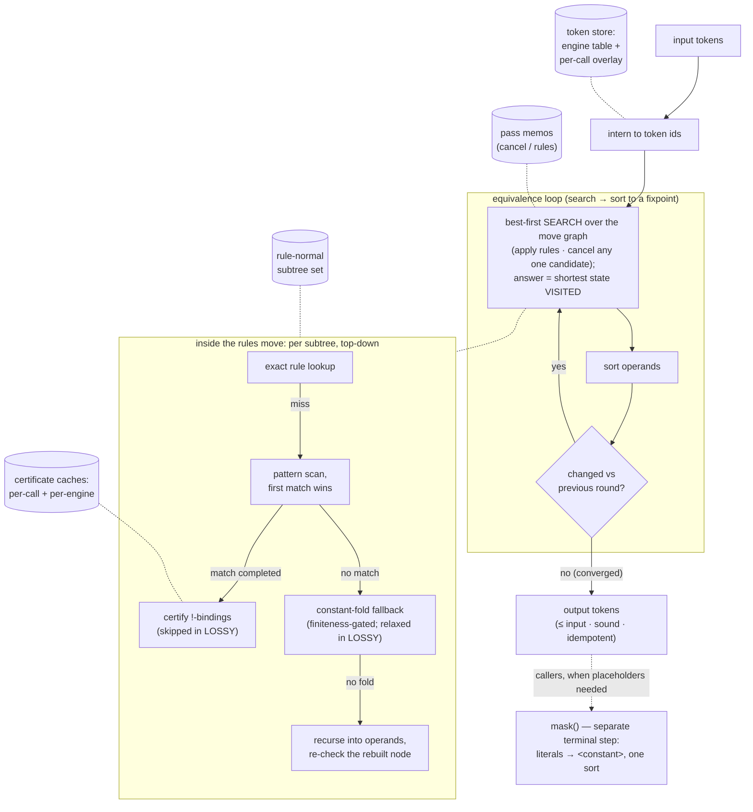

# SimpliPy Documentation

SimpliPy is a high-throughput symbolic simplifier built for workloads where
classic tools like SymPy struggle—think millions of expressions in the pre-training of
prefix-based transformer models. Instead of converting tokens into
heavyweight objects and back again, SimpliPy keeps expressions as lightweight
prefix lists, enabling rapid rewriting and direct integration with machine
learning pipelines.

SimpliPy is the shared expression-engine leaf of a four-package family:
`simplipy` ◄── `symbolic-data` ◄── { `flash-ansr`, `srbf` }. Its direct
downstream is `symbolic-data`, the model-agnostic symbolic-regression data
layer, and through it SimpliPy feeds Flash-ANSR training and the srbf benchmark
framework.


## Why SimpliPy Exists

SymPy excels at exact algebra, but its object graph and string parsing introduce
costs that dominate at scale. SimpliPy was created to remove those bottlenecks:

- **Prefix-first representation** – Expressions stay as token lists the entire
	time, so there's no repeated parsing or AST allocation.
- **Deterministic pipelines** – Rule application, operand sorting, and the separate
	literal-masking step (`mask`) always produce the same layout, which keeps downstream
	caches warm.
- **ML-pipeline integration** – Outputs stay in the prefix token space consumed
	by the `symbolic-data` layer (and through it by Flash-ANSR training) without
	any conversion step, making it practical to simplify millions of candidates
	per minute.


## Performance

As of `0.3.0` the inline phase (`simplify`, conversions, validation) runs in a compiled Rust
extension (`simplipy._core`), a large speed-up over the previous pure-Python engine at identical
simplification behaviour.

0.6.0 reworks the match-time economics at byte-identical outputs: `!`-sort certificates
are evaluated only after a completed syntactic match (instead of per candidate
attempt), memoized per call and in a generational per-engine cache that never stops
memoizing, the fixpoint loop memoizes whole passes and rule-normal subtrees, and the
hot path runs on interned token ids (~20× fewer allocations per call). On a
65,536-expression training-prior benchmark, large certificate-bearing rulesets run
~59× faster than 0.5.0; certificate-free rulesets run ~2.3× faster.

Since 0.7.0 there is a single compiled engine line, and the published ruleset artifacts
(`2-1`, `3-2`, `4-3`, …) are the distinguishing factor between engines. Rule application
always considers every pattern in the loaded artifact (the former `max_pattern_length`
knob was removed in 0.10.0).


ECDFs of simplification wall-clock time (**top row**) and simplification ratio `|simp|/|orig|` in
prefix tokens (**bottom row**, inset: low-ratio tail), over 65,536 randomly generated
Lample-Charton expressions from the Flash-ANSR v23.0 training prior. Three axes vary SimpliPy
(green) against a fixed **SymPy** reference (orange `ratio=None` / red `ratio=1`): **Mined
Rulesets** — the `2-1`/`3-2`/`4-3` ruleset artifacts, every pattern active
(darker = larger); **Safe vs Aggressive** — `4-3` in the deployed `SOUND` mode vs the training-only
`LOSSY` mode; **Search Budget** — `4-3` SOUND at node budgets 1 to 48. SimpliPy is timed per call
(`perf_counter`, gc off); SymPy is given each `<constant>` as a free symbol and simplified
symbolically inside a per-expression worker with a 1 s timeout, then scored by its native prefix
length; SymPy's workers run 24-wide while SimpliPy is timed single-threaded. Expressions SymPy
does not finish inside its budget are scored as what they are — infinite time, ratio 1 (not
simplified) — and stay in the denominator, so its time curve plateaus at the fraction it
completed and its ratio curve carries a step at exactly 1; renormalising over only its successes
would inflate its low-ratio tail. The measured quantities are the two ECDFs; the plot, not this
caption, reports what they show.


## Simplification Pipeline (Pseudo-Algorithm)

```text
function simplify(expr, node_budget=48, mode=SOUND):
    tokens = parse(expr)                        # infix→prefix, or validate existing prefix

    loop:                                       # the EQUIVALENCE loop: search → sort to a fixpoint
        best   = search(tokens, node_budget, mode)  # best-first over the rewrite MOVE graph
                                                     # (apply the rules pass, or cancel any one
                                                     # candidate); answer = shortest state VISITED
        sorted = sort_operands(best)            # canonical order for commutative operands
        if sorted == tokens: break              # converged
        tokens = sorted
    return tokens                               # never longer than the input (the input is
                                                # state zero), sound and idempotent by construction
```

`simplify` is the **equivalence loop only**. Every move — cancellation, rule application, and
the constant-fold fallback — preserves the function almost everywhere, so the result is sound,
never longer than the input (the input is the first candidate), and idempotent by construction.
The search replaces the old fixed cancel→rules order: cancellation is non-confluent (taking one
candidate can destroy another), so the kernel searches a bounded move graph instead of guessing
(the `node_budget` parameter caps how many nodes it expands; default 48).

**Masking is not part of `simplify`.** Relabelling numeric literals to the generic `<constant>`
placeholder is a *representation* step for a downstream model that cannot consume literals, not
an equivalence-preserving rewrite. It is a separate terminal step (the `simplipy.masking`
module) — apply it to `simplify`'s output and never re-`simplify` the result:

```python
from simplipy import masking
tokens = masking.mask(engine.simplify(expr), engine,
                      masking.mask_values_keep_structure)   # literals -> <constant>
```

The `mode` argument selects the soundness/recall trade-off; see **Soundness Modes** below.
Since 0.6.0 the loop memoizes whole passes and rule-normal subtrees per call, so the
convergence-confirming iteration and unchanged subexpressions cost hash lookups, not re-scans.

The same call as a flowchart, with the memo state each stage touches drawn as
cylinders (dotted links are lookups/inserts, not data flow):



The compiled core implements ONE engine line, carrying the contract semantics: numeric
constant folding (including non-finite results such as `1/0 -> float("inf")`), the
corrected conversions, and real-semantics power evaluation. Byte-exact reproduction of
historical behavior (the dev_7-3 / v23.0 era) is served by installing `simplipy<=0.6.0`.


## Soundness Modes

`simplify(expr, mode=...)` selects a point on a single ordinal soundness axis, `simplipy.Mode`.
Two rungs are implemented; `EXACT` and `AE` are reserved positions in the decided
`EXACT ≤ SOUND ≤ AE ≤ LOSSY` ordering.

- **`Mode.SOUND`** (the default) is equivalence-preserving and idempotent. Every rewrite edge
  carries a soundness gate: rules only bind a composite subtree that a match-time certificate
  proves defined-and-finite almost everywhere (the `!`-sort); cancellation only cancels leaves
  where the group axioms hold; and the constant-fold collapses a subtree to a free `<constant>`
  only when its value is finite on a positive-measure set of its constants. This is the mode to
  use whenever the output is scored against data from an unknown function (inference, recovery
  scoring, holdout matching).

- **`Mode.LOSSY`** relaxes *all three* gates together — every rule placeholder binds any subtree
  (`!`-certificate skipped), cancellation drops its group-axiom gate, and the constant-fold drops
  its finiteness gate. It only ever binds *more*, so it recovers reductions the sound line leaves
  on the table, at the cost of firing off the certified domain (pole/`inf`/`nan`-bearing
  cofactors). It is **not** equivalence-preserving.

```python
from simplipy import Mode

# log(C) is undefined for C <= 0: SOUND keeps the composition, LOSSY collapses it.
engine.simplify(['exp', 'log', '<constant>'], mode=Mode.SOUND)  # -> ['exp', 'log', '<constant>']
engine.simplify(['exp', 'log', '<constant>'], mode=Mode.LOSSY)  # -> ['<constant>']

# (x^2)^0.5 equals |x|, not x: SOUND refuses the flattening, LOSSY takes it.
engine.simplify(['pow', 'pow', 'x0', '2', '0.5'], mode=Mode.SOUND)  # -> unchanged
engine.simplify(['pow', 'pow', 'x0', '2', '0.5'], mode=Mode.LOSSY)  # -> ['x0']

# A finite-a.e. subtree (pole at a single measure-zero constant) folds in BOTH modes:
engine.simplify(['inv', '<constant>'])                       # -> ['<constant>']   (1/C)
```

**Why two modes, and how flash-ansr uses them.** The downstream trainer
([flash-ansr](https://github.com/psaegert/flash-ansr), a transformer for symbolic regression)
uses each mode on a different side of its pipeline:

- **Training-data generation uses `Mode.LOSSY`.** A skeleton is lossy-simplified and the numeric
  data is then generated *from that simplified form* — so the target the model learns and the data
  it is trained on are the *same* expression (`target == data`). There is no external ground-truth
  function for LOSSY to violate, so the aggressive reductions are safe here and they give the model
  the shortest, most canonical target. (An `exp(log(<constant>))` that survives cancellation, for
  instance, becomes a plain `<constant>`, which is what the generated data reflects.)

- **Inference and recovery scoring use `Mode.SOUND`.** At test time the data comes from an unknown
  true function; the predicted skeleton must be simplified *without* changing what it computes, or
  the fit and the score would drift. Only the equivalence-preserving mode is safe there.

That split is the whole reason both modes exist: LOSSY maximizes canonicalization where the
simplified form *defines* the data, and SOUND guarantees equivalence where it must not.


## Key Components

- **Parsing & normalization** – `SimpliPyEngine.parse` and
	`SimpliPyEngine.convert_expression` convert infix input, harmonize power
	operators, and propagate unary negation without losing prefix fidelity.
- **Term cancellation** – each fixpoint pass identifies subtrees that appear
	with opposite parity or redundant factors and prunes them before any rules
	run (the compiled core's cancellation stage).
- **Rule execution** – `SimpliPyEngine.compile_rules` syncs machine-discovered or
	human-authored simplifications into the compiled core, which performs fast
	top-down, first-match-wins rewriting in each iteration.
- **Canonical ordering** – the final sorting stage imposes a stable ordering for
	commutative operators, ensuring identical expressions share identical token
	layouts.
- **Rule discovery workflow** – `SimpliPyEngine.find_rules` explores expression
	space natively on the compiled core (parallelized across all cores via rayon),
	confirms identities with numeric sampling, and writes back deduplicated
	rulesets that future engines can load instantly.


## Quickstart

```bash
pip install simplipy
```

```python
import simplipy as sp

engine = sp.SimpliPyEngine.load("acj-4-3", install=True)   # the published AC-engine artifact

# Simplify prefix expressions
engine.simplify(['/', '<constant>', '*', '/', '*', 'x3', '<constant>', 'x3', 'log', 'x3'])
# -> ['<mul>', '<constant>', '<div>', 'log', 'x3', '</mul>']   (the native tagged form: C/log(x3))

# The `form` parameter re-projects the same canonical answer: 'infix' renders it,
# 'explicit' gives the binary-prefix dialect that is_valid / prefix_to_infix consume
# (tagged output itself is accepted back as input by simplify/complexity/masking)
engine.simplify(['/', '<constant>', '*', '/', '*', 'x3', '<constant>', 'x3', 'log', 'x3'], form='infix')
# -> '<constant>/log(x3)'

# Simplify infix expressions
engine.simplify('x3 * sin(<constant> + 1) / (x3 * x3)')
# -> '<constant>/x3'

# Mask numeric literals to <constant> AFTER simplifying (for models that need placeholders)
from simplipy import masking
masking.mask(engine.simplify(['+', 'x1', '3.14']), engine,
             masking.mask_values_keep_structure)
# -> ['<add>', 'x1', '<constant>', '</add>']

# Aggressive canonicalization for training targets (see Soundness Modes)
from simplipy import Mode
engine.simplify(['exp', 'log', '<constant>'], mode=Mode.LOSSY)   # -> ['<constant>']
```

Available engines can be browsed and downloaded from Hugging Face.
The SimpliPy Asset Manager handles listing, installing, and uninstalling assets:

```python
sp.list_assets("engine")
# --- Available engine assets ---
# - acj-4-3  [installed]  Complete AC-judged rule mine of the clean 23-operator vocabulary
#                         (sources to length 4, targets to length 3), ... Pairs with simplipy >= 0.12.
# - acj-3-2  [installed]  Complete AC-judged rule mine ... (sources to length 3, targets to length 2), ...
# - acj-2-1  [installed]  Complete AC-judged rule mine ... (sources to length 2, targets to length 1), ...
# - base                  Bare 23-operator engine configuration (no rules): the clean-vocabulary
#                         starting point for fresh mining. Pairs with simplipy >= 0.12.
# - ...                   (pre-0.12 assets remain listed for older installs; they refuse to load on 0.12)
```

## Artifacts, provenance and compatibility

Every published engine asset is four files: `config.yaml` (the operator table and
engine configuration), `rules.json` (the mined ruleset), `mine.yaml` (the exact mine
configuration — each artifact is byte-deterministically reproducible from it with one
`simplipy find-rules` command), and `rules.json.provenance.json`. The provenance
sidecar records how the ruleset came to be: the mine parameters, the core build stamp
(package version plus git revision of the compiled core), the soundness state at mine
time (certificate kill-switch states, every artifact-affecting environment override
recorded verbatim, and the interval layer's fail-closed miss counters), and the
measure fingerprint (the μ constants and probe values with a digest) — so artifacts
mined under different orderings are distinguishable from provenance alone.

Compatibility is enforced at load, not documented and hoped for (`simplipy.compat`):
artifacts carry an `engine_generation` pin in `config.yaml` (generation 2 is the AC
engine's clean 23-operator vocabulary), the package carries the allowlist of
generations it serves, and the refusal is mutual and actionable — a generation-1
artifact on 0.12 raises with `pin the legacy package to load it: pip install
"simplipy<0.12"`, and a too-new artifact points at upgrading simplipy. Configs
without a pin are classified by vocabulary: any retired hyper-operator token means
generation 1, so already-published legacy artifacts refuse without republishing.

## Normalization

Besides the engine, SimpliPy exports pure-string normalization helpers at the
package root: `normalize_skeleton`, `normalize_expression`, and
`normalize_variable_token` (also available as `simplipy.normalization`). They
canonicalize a prefix token sequence so that two expressions that are "the same"
up to variable renaming / constant values compare equal, giving downstream
consumers (holdout matching, symbolic-recovery scoring) identical behavior by
construction.

```python
import simplipy as sp

# Skeleton form: variables -> x{n}, numeric literals -> <constant>
sp.normalize_skeleton(['+', 'v1', '2.5'])
# -> ['+', 'x1', '<constant>']

# Expression form: variables canonicalized, numeric literals kept intact
sp.normalize_expression(['+', 'V1', '2.5'])
# -> ['+', 'x1', '2.5']

# Classify / canonicalize a single token -> (normalized_token, is_variable)
sp.normalize_variable_token('X3')
# -> ('x3', True)
sp.normalize_variable_token('sin')
# -> ('sin', False)
```

See the [Normalization](api.md#normalization) API reference for details.

## Where to go next

- Explore the [API reference](api.md) for function-level details.
- Read the [rule authoring guide](rules.md) to build simplification rule sets.

Happy simplifying!