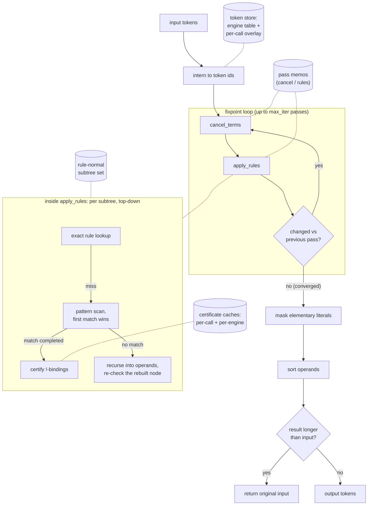

# SimpliPy Documentation

SimpliPy is a high-throughput symbolic simplifier built for workloads where
classic tools like SymPy struggle—think millions of expressions in the pre-training of
prefix-based transformer models. Instead of converting tokens into
heavyweight objects and back again, SimpliPy keeps expressions as lightweight
prefix lists, enabling rapid rewriting and direct integration with machine
learning pipelines.

SimpliPy is the shared expression-engine leaf of a four-package family:
`simplipy` ◄── `symbolic-data` ◄── { `flash-ansr`, `srbf` }. Its direct
downstream is `symbolic-data`, the model-agnostic symbolic-regression data
layer, and through it SimpliPy feeds Flash-ANSR training and the srbf benchmark
framework.


## Why SimpliPy Exists

SymPy excels at exact algebra, but its object graph and string parsing introduce
costs that dominate at scale. SimpliPy was created to remove those bottlenecks:

- **Prefix-first representation** – Expressions stay as token lists the entire
	time, so there's no repeated parsing or AST allocation.
- **Deterministic pipelines** – Rule application, operand sorting, and literal
	masking always produce the same layout, which keeps downstream caches warm.
- **ML-pipeline integration** – Outputs stay in the prefix token space consumed
	by the `symbolic-data` layer (and through it by Flash-ANSR training) without
	any conversion step, making it practical to simplify millions of candidates
	per minute.


## Performance

As of `0.3.0` the inline phase (`simplify`, conversions, validation) runs in a compiled Rust
extension (`simplipy._core`), a large speed-up over the previous pure-Python engine at identical
simplification behaviour.

0.6.0 reworks the match-time economics at byte-identical outputs: `!`-sort certificates
are evaluated only after a completed syntactic match (instead of per candidate
attempt), memoized per call and in a generational per-engine cache that never stops
memoizing, the fixpoint loop memoizes whole passes and rule-normal subtrees, and the
hot path runs on interned token ids (~20× fewer allocations per call). On a
65,536-expression training-prior benchmark, large certificate-bearing rulesets run
~59× faster than 0.5.0; certificate-free rulesets run ~2.3× faster.


ECDFs of simplification wall-clock time (left) and simplification ratio (right) across maximum
pattern lengths `L_max = 0`–`7`. **Top:** SimpliPy `0.3.0` (Rust, green); **bottom:** SimpliPy
`0.2.15` (pure Python, blue); the SymPy baseline is orange/red. The Rust inline engine is roughly
5× to 100× faster than the pure-Python engine at the same `L_max` (≈ 15× at `L_max = 4`) and orders
of magnitude faster than SymPy, while producing near-identical simplification ratios.


## Simplification Pipeline (Pseudo-Algorithm)

```text
function simplify(expr, max_iter=5):
    tokens = parse(expr)               # infix→prefix, or validate existing prefix

    for _ in range(max_iter):          # fixpoint loop
        tokens = cancel_terms(tokens)  # one additive/multiplicative cancellation per pass
        tokens = apply_rules(tokens)   # indexed rewrite patterns, top-down, first match wins
        if unchanged_vs_previous_pass:
            break                      # converged

    tokens = mask_literals(tokens)     # collapse trivial numerics to <constant> (before sort)
    tokens = sort_operands(tokens)     # canonical order for commutative ops
    return tokens if len(tokens) <= len(input) else input   # longer results are rejected
```

Masking runs before sorting (so the canonical operand order is computed on the masked
tokens and the mask/sort pair is a fixpoint), both run once after the loop, and a
result longer than the input is rejected in favor of the input. Since 0.6.0 the loop
memoizes whole passes and rule-normal subtrees per call, so the convergence-confirming
iteration and unchanged subexpressions cost hash lookups instead of re-scans — with
byte-identical outputs.

The same call as a flowchart, with the memo state each stage touches drawn as
cylinders (dotted links are lookups/inserts, not data flow):



The compiled core implements two *engine lines*, selected per call via its `fold`
parameter. The **faithful** line (`fold=False`, plain conversions) is byte-identical to
the frozen 0.2.15 pure-Python reference, kept so results produced against that engine
stay reproducible; the **numeric** line (`fold=True`, fixed conversions) adds numeric
constant folding and the conversion bug fixes, and is what the shipped Python API
routes.


## Key Components

- **Parsing & normalization** – `SimpliPyEngine.parse` and
	`SimpliPyEngine.convert_expression` convert infix input, harmonize power
	operators, and propagate unary negation without losing prefix fidelity.
- **Term cancellation** – each fixpoint pass identifies subtrees that appear
	with opposite parity or redundant factors and prunes them before any rules
	run (the compiled core's cancellation stage).
- **Rule execution** – `SimpliPyEngine.compile_rules` syncs machine-discovered or
	human-authored simplifications into the compiled core, which performs fast
	top-down, first-match-wins rewriting in each iteration.
- **Canonical ordering** – the final sorting stage imposes a stable ordering for
	commutative operators, ensuring identical expressions share identical token
	layouts.
- **Rule discovery workflow** – `SimpliPyEngine.find_rules` explores expression
	space natively on the compiled core (parallelized across all cores via rayon),
	confirms identities with numeric sampling, and writes back deduplicated
	rulesets that future engines can load instantly.


## Quickstart

```bash
pip install simplipy
```

```python
import simplipy as sp

engine = sp.SimpliPyEngine.load("dev_7-3", install=True)

# Simplify prefix expressions
engine.simplify(['/', '<constant>', '*', '/', '*', 'x3', '<constant>', 'x3', 'log', 'x3'])
# -> ['/', '<constant>', 'log', 'x3']

# Simplify infix expressions
engine.simplify('x3 * sin(<constant> + 1) / (x3 * x3)')
# -> '<constant> / x3'
```

Available engines can be browsed and downloaded from Hugging Face.
The SimpliPy Asset Manager handles listing, installing, and uninstalling assets:

```python
sp.list_assets("engine")
# --- Available Assets ---
# - dev_7-3         [installed]  Development engine 7-3 for mathematical expression simplification.
# - dev_7-2                      Development engine 7-2 for mathematical expression simplification.
```

## Normalization

Besides the engine, SimpliPy exports pure-string normalization helpers at the
package root: `normalize_skeleton`, `normalize_expression`, and
`normalize_variable_token` (also available as `simplipy.normalization`). They
canonicalize a prefix token sequence so that two expressions that are "the same"
up to variable renaming / constant values compare equal, giving downstream
consumers (holdout matching, symbolic-recovery scoring) identical behavior by
construction.

```python
import simplipy as sp

# Skeleton form: variables -> x{n}, numeric literals -> <constant>
sp.normalize_skeleton(['+', 'v1', '2.5'])
# -> ['+', 'x1', '<constant>']

# Expression form: variables canonicalized, numeric literals kept intact
sp.normalize_expression(['+', 'V1', '2.5'])
# -> ['+', 'x1', '2.5']

# Classify / canonicalize a single token -> (normalized_token, is_variable)
sp.normalize_variable_token('X3')
# -> ('x3', True)
sp.normalize_variable_token('sin')
# -> ('sin', False)
```

See the [Normalization](api.md#normalization) API reference for details.

## Where to go next

- Explore the [API reference](api.md) for function-level details.
- Read the [rule authoring guide](rules.md) to build simplification rule sets.

Happy simplifying!