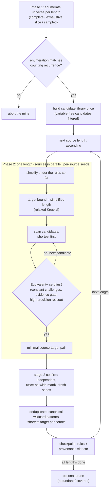
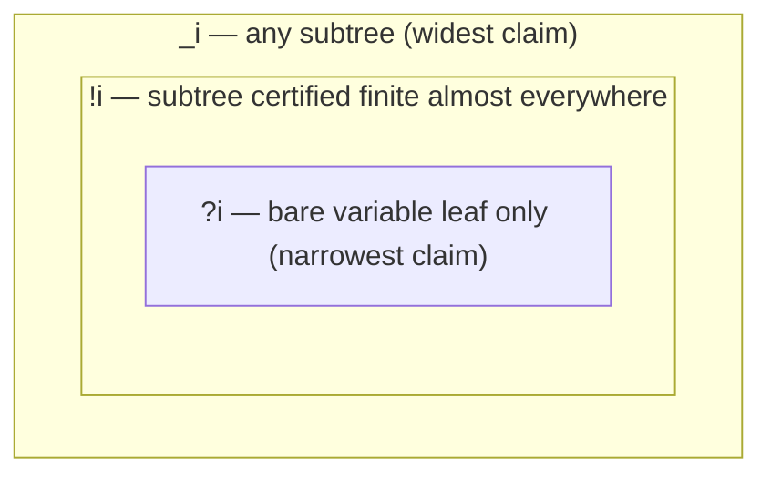

# Creating Rulesets

SimpliPy's simplification rules are not hand-written: they are **mined** — discovered by
exhaustively enumerating candidate expressions and certifying, numerically, which longer
expressions are equivalent to shorter ones. This page explains the procedure and shows a
complete mining configuration.

## How mining works

`SimpliPyEngine.find_rules` runs two phases:

**Phase 1 — building the source universe.** All valid prefix expressions up to
`max_source_pattern_length` are enumerated bottom-up, and the enumeration is cross-checked
against an exact counting recurrence — the two must agree exactly, or the mine aborts.
Lengths whose complete universe is too large to enumerate can instead be represented by a
uniform sample from the complete universe (`source_sample_per_length`); coverage is always
reported, and the drawn sample is validated per run.

**Phase 2 — certifying rules, shortest sources first.** For each source expression:

1. **Prune**: if the rules found so far already shorten the source, the search is
   *tightened* rather than skipped — only targets strictly shorter than what `simplify`
   already reaches are accepted (`relaxed_kruskal`, the default; pass
   `relaxed_kruskal=False` to skip already-shortened sources entirely).
2. **Scan**: the source is compared against every candidate replacement, in
   order of increasing length, so the first match is a *minimal* target. The candidate
   library is built once per mine; variable-free candidates of length ≥ 2 are excluded
   (`candidate_fold_filter`, default on) — a provably behavior-preserving optimization,
   since any source they could match is already matched by the length-1 `<constant>`
   candidate.
3. **Certify**: a candidate matches only if it reproduces the source's values on a
   heavy-tailed, seeded evaluation matrix — across `constants_fit_challenges` re-drawings
   of the source's constants, with constants in candidates fitted by a deterministic
   closed-form solver where possible and a restarted optimizer otherwise. Rows where the
   source is finite must agree within `rtol`/`atol`; rows where the source is undefined
   may be completed by the replacement (so `x/x → 1` certifies, in the sense of the limit),
   and a minimum number of informative rows is required (`min_informative`).
4. **Confirm**: every mined pair is re-verified on an independent, twice-as-wide
   evaluation matrix with fresh seeds before it enters the rule set.
5. **Deduplicate**: rules are canonicalized into wildcard patterns, keeping the shortest
   target per source.

The same pipeline as one picture (Algorithm 1 in
[the formal specification](algorithm.md) is the line-by-line version):



The whole procedure is **deterministic**: a fixed `seed` reproduces the ruleset
byte-for-byte, independent of process, hash randomization, or thread count. Alongside the
output, a **provenance sidecar** (`<output>.provenance.json`) records every parameter,
derived seed, the evaluation-matrix specification, and per-length universe coverage, so a
published ruleset is reproducible from its artifact alone.

## Rule sorts: `_`, `?`, and `!`

Every placeholder in a shipped rule carries a *sort* — the binding claim its sigil
encodes, enforced by the matcher at apply time:

- **`_i` — any subtree.** The widest claim: the slot binds an arbitrary expression.
- **`?i` — variable leaf only.** The narrowest claim: the slot binds a bare variable,
  never a composite subtree, a literal, or `<constant>`.
- **`!i` — certified subtree.** Binds a variable leaf freely; a composite subtree binds
  only when a match-time certificate proves it defined and finite almost everywhere
  (an adaptive interval analysis over the reals). Fail-closed: what cannot be
  certified is not bound.

The three claims nest — everything a narrower sort binds, the wider sorts bind too:



Sorts exist because a rewrite can be value-sound when a slot holds a variable yet
unsound when it holds a composite carrying poles or infinities into the pattern — the
certificate is what lets a rule make the wider claim without giving up soundness.
Since 0.6.0 the certificate is evaluated once per *completed* syntactic match rather
than during every candidate attempt, and memoized (per call, plus a generational
per-engine cache), which makes `!`-bearing rulesets fast at scale with identical
verdicts.

### Diagnostics

Setting the environment variable `SIMPLIPY_LEAF_WILDCARDS=1` makes every `_i`
placeholder bind variable leaves only (demoting all wildcards to `?`-sort semantics),
which isolates whether a behavior difference comes from composite wildcard bindings;
default off restores the deployed subtree semantics.

## Running a mine

```sh
simplipy find-rules -e "path/to/my_config.yaml" -c "path/to/create_my_config.yaml" -o "path/to/my_rules.json" -v --reset-rules
```

- `-e` is the path to the engine configuration file to use as a backend
- `-c` is the path to the configuration file containing parameters for finding rules
- `-o` is the output path for the collected rules
- `-v` enables verbose output
- `--reset-rules` will start with an empty rule set, otherwise it will append to the existing rules loaded with the engine

A complete mining configuration:

```yaml
# Special symbols available as expression leaves (beyond the dummy variables).
# <constant> is the wildcard that matches any fitted constant.
extra_internal_terms: [
  '<constant>',
  '0',
  '1',
  '(-1)',
  'np.pi',
  'np.e',
  'float("inf")',
  'float("-inf")',
  'float("nan")'
]

# Number of dummy variables (null = derived from max_source_pattern_length)
dummy_variables: null

# Maximum number of tokens in a source (left-hand side) expression
max_source_pattern_length: 7

# Maximum number of tokens in a target (replacement) expression.
# Targets are never sampled: the candidate library must stay complete,
# or the minimality guarantee is lost.
max_target_pattern_length: 4

# Universe policy: lengths whose complete universe is infeasible to enumerate
# are drawn uniformly from the complete universe instead. With the operator
# set above, lengths through 5 are enumerable; 6 and 7 are sampled.
source_sample_per_length:
  6: 1000000
  7: 1000000

# Rows of the evaluation matrix (heavy-tailed mixture, drawn from `seed`)
n_samples: 1024

# Re-drawings of source constants per certification (guards against
# coincidental matches at particular constant values)
constants_fit_challenges: 16

# Optimizer restarts per constant fit (accounts for non-convergence)
constants_fit_retries: 16

# Acceptance tolerances (relative / absolute, per row)
rtol: 1.0e-9
atol: 1.0e-12

# Master seed: reproduces the entire mine, byte-for-byte
seed: 42

# Re-verify every mined rule on an independent evaluation matrix
confirm: true

# Exclude variable-free candidates from the library (behavior-preserving speedup)
candidate_fold_filter: true

# Optional: LLM/human-proposed rules, certified against the mined state at the
# end of the run (see "LLM-proposed rules" below). Paths starting with ./ are
# resolved relative to this config file; absolute paths are used as-is.
proposals: ./llm_proposals.json
```

Complete enumeration through length 5 covers tens of millions of sources and is a
multi-day run on a modern many-core CPU; the sampled lengths add time proportional to
their sample sizes. Progress, per-length rule counts, and universe coverage are printed
as the mine advances, and the output file plus its provenance sidecar are updated after
every completed length.

## LLM-proposed rules

Mining guarantees completeness where enumeration or sampling reaches, but the source
universe grows so fast with expression length (billions at length 7, and worse beyond)
that uniform sampling essentially never draws the *mathematically salient* long
identities — `sin²x + cos²x → 1` is a length-7 source with a ~0.03% chance of appearing
in a million-draw sample. A language model, by contrast, can name such identities
directly. SimpliPy therefore supports a complementary channel:

**an LLM proposes candidate source expressions; the engine certifies them with the
exact same gates as mined rules.** Proposals only ever *add* source expressions, so a
certified proposal is precisely as sound as a mined rule — the model's correctness is
never trusted, only its taste in candidates. Wrong proposals cost about a CPU-second
each and are rejected.

### The reproduction path: `proposals:` in the find-rules config

The channel is wired into the miner itself, so reproducing a mined-plus-proposed
ruleset is **one config and one command**: add a `proposals:` key to the find-rules
YAML and run `find-rules` as usual.

```yaml
# ... the mining configuration from above ...
proposals: ./llm_proposals.json
```

```sh
simplipy find-rules -e "path/to/my_config.yaml" -c "path/to/create_my_config.yaml" -o "path/to/my_rules.json" -v --reset-rules
```

After the mining length loop completes — and before the optional prune, so certified
proposals face the same pruning as mined rules — every proposal is certified against
the just-mined rule state with the exact machinery of the mine: the same evaluation
matrices, constant challenges, tolerances, and seeds derived from the master `seed`.
A proposal the mined rules already shorten is skipped exactly like an
already-reducible source, and a certified proposal joins the ruleset through the same
deduplication path (shortest target per canonical source).

Two proposal-file schemas are accepted:

- the **consolidated artifact format** — a JSON object with a `"proposals"` key whose
  entries are objects with `"source"` (a prefix token list) and an optional
  `"target"` (a prefix token list, used as the certification *hint*); any other keys
  (`why`, `family`, `tier`, ...) are ignored;
- a **bare list** of such `{source, target?}` objects.

Each proposal ends in exactly one of four outcomes — `certified` (joined the
ruleset), `already_covered` (the mined rules already shorten it), `rejected`
(invalid, no shorter equivalent found, or failed numerical verification), or
`duplicate` (certified, but canonically identical to an earlier certified proposal) —
and the provenance sidecar records the proposals file, its sha256, and the
per-outcome counts. The pass is deterministic: proposals are processed in file order
with content-derived per-proposal seeds, so editing the file never rerolls the
certification of untouched proposals, and two runs from the same seed and file are
byte-identical.

### Programmatic alternative: `certify_rules`

To certify proposals against an already-built engine without re-mining, use the
`certify_rules` API directly:

```python
import simplipy as sp
from simplipy.utils import deduplicate_rules

engine = sp.SimpliPyEngine.load("dev_7-3")

proposals = [
    ["+", "pow2", "sin", "x0", "pow2", "cos", "x0"],   # sin^2 + cos^2
    ["mult2", "*", "sin", "x0", "cos", "x0"],          # 2 sin cos
    ["*", "-", "x0", "x1", "-", "x1", "x0"],           # (x-y)(y-x)
]
hints = [None, None, ["neg", "pow2", "-", "x0", "x1"]]  # optional target suggestions

extra_terms = ['<constant>', '0', '1', '(-1)', 'np.pi', 'np.e']  # target vocabulary
certified = engine.certify_rules(proposals, hints,
                                 extra_internal_terms=extra_terms, verbose=True)
# -> [(source, target, 'minimal' | 'verified'), ...]

dummies = ["x0", "x1"]
engine.simplification_rules = deduplicate_rules(
    engine.simplification_rules + [(s, t) for s, t, _ in certified], dummies)
engine.compile_rules()
```

For each proposal, `certify_rules` checks validity, skips sources the engine already
reduces, searches the complete candidate library for a certified-**minimal** target,
and re-verifies the winning pair on an independent evaluation matrix. If no
library-sized target exists, an optional per-proposal **hint** is verified instead —
sound, but marked `'verified'` rather than `'minimal'` since no shorter form was ruled
out. Targets certified this way may have any length, as long as they are shorter than
the source. The mining channel above runs this same chain per proposal; the only
difference is bookkeeping (the mine's matrices and seeds, and the provenance record).

### How we use this (and what to expect)

The rule packs for the upcoming engine asset were proposed by Claude, prompted with the
exact grammar (the operator inventory, the leaf symbols including the `<constant>`
wildcard, prefix arity rules, and a source-length window) and split across identity
families — trigonometric, hyperbolic, exponential/logarithmic, algebraic cancellations,
powers and roots, constant arithmetic, multi-variable symmetry, and special values —
with each family asked to enumerate systematically and to include operand-order and
factored variants as separate entries (rule matching is syntactic, so distinct tree
spellings of one identity are distinct rules).

Observed over ~2,400 proposals: generating a wave takes minutes; certification runs at
roughly 1–2 seconds per proposal; about half of all proposals are true identities the
engine already covers (rejected as redundant); under 1% fail numerical verification
outright; and roughly a third certify — the majority at source lengths that uniform
sampling would never reach, with the model's own target suggestion matching the
certified-minimal target about 85–90% of the time.

## Replicating a large ruleset end to end

1. **Propose** long identities with an LLM of your choice, prompting with your engine's
   grammar; ask for systematic family-by-family enumeration and tree-spelling variants.
   Save the proposals as a JSON file (either schema above).
2. **Mine + certify** with the configuration above, including its `proposals:` key —
   one command (`simplipy find-rules ...`) runs the mine and then certifies every
   proposal against the freshly mined state (roughly 1–2 seconds per proposal).
   Complete enumeration through length 5 plus one-million-source samples at lengths 6
   and 7 is roughly a week on a modern 16-core CPU; the provenance sidecar records
   everything needed to reproduce the run from its seed, including the proposal file's
   sha256 and per-outcome counts.
3. **Post-process** (optional): `prune-rules` / `prune-covered-rules` /
   `resolve-rules`, below.

Steps 2–3 are deterministic given the seed and the proposals file; step 1 is
inherently not, so keep the proposals file under version control — it, not the model
transcript, is the reproducible artifact.

# Post-processing Rules

Three commands refine an existing rule set loaded from an engine and write the
result to a JSON file (they do not modify the installed asset in place):

```sh
# Remove explicit rules that are already subsumed by wildcard-pattern rules
simplipy prune-rules -e "dev_7-3" -o "path/to/pruned_rules.json" -v

# Remove rules that the remaining rules already cover compositionally
simplipy prune-covered-rules -e "dev_7-3" -o "path/to/pruned_rules.json" -v

# Replace <constant> placeholders with concrete numeric values in all-numeric rules
simplipy resolve-rules -e "dev_7-3" -o "path/to/resolved_rules.json" -v
```

- `-e` is the engine name (e.g. `dev_7-3`) or a path to an engine configuration file
- `-o` is the output path for the post-processed rules
- `-v` enables verbose progress output

## Pruning rulesets

Two prunes shrink a ruleset without changing what the engine can simplify, under
different criteria:

- **`SimpliPyEngine.prune_redundant_rules`** (CLI: `prune-rules`) removes *explicit*
  rules (no placeholders) that are shadowed by wildcard-pattern rules: an explicit rule
  is dropped only if the engine without it still simplifies the rule's source to
  **exactly** the same target (an *equality* criterion — constant folding and term
  cancellation count toward coverage). Rules are tested and removed serially, so two
  rules that are each redundant only in the other's presence are never both dropped.
- **`SimpliPyEngine.prune_covered_rules`** (CLI: `prune-covered-rules`) is the
  stronger, compositional prune: it removes **any** rule — pattern rules included —
  whose effect the remaining rules achieve on their own. A rule is covered only if
  every instantiation variant of its source still simplifies to **at most** the length
  of the corresponding target (a *≤-length* criterion): each slot is instantiated as a
  distinct variable leaf, `<constant>` is kept literal so native constant folding
  cannot fake coverage, and wide slots (`_`/`!` sigils) are additionally probed with
  composite subtrees, since leaf-only instantiation under-tests wide-sort claims.
  Rules are processed in source-length waves, longest first; each wave is tentatively
  removed and then repaired to a fixpoint against an engine rebuilt from the kept
  rules, so the result is **deterministic** for a given rule list — and greedy: valid,
  not necessarily minimal.

Both are also available at the end of a mine through the `prune` parameter:
`find_rules(prune=True)` runs the redundant-rule prune after discovery, and
`find_rules(prune='covered')` runs the covered-rule prune instead.

Note that the covered prune trades ruleset size against one-step reachability: a
covered rule's source still simplifies at least as short, but possibly through
intermediate rewrites inside the same `simplify` call. When set-level closure
guarantees matter, re-verify the pruned engine on a benchmark corpus and check that no
meaningful fraction of outputs got longer.

# Managing Engine Assets

List the engines (and test-data assets) available on Hugging Face and which are
already installed locally:

```sh
simplipy list --type engine
# --- Available Assets ---
# - dev_7-3         [installed]  Development engine 7-3 for mathematical expression simplification.
# - dev_7-2                      Development engine 7-2 for mathematical expression simplification.

simplipy list --installed        # only assets already downloaded
```

Install or remove an asset by name:

```sh
simplipy install dev_7-3         # download an asset from Hugging Face (--force to reinstall)
simplipy remove dev_7-3          # remove a locally installed asset
```

The same operations are available from Python (this is also what the engine loader uses under the hood):

```python
import simplipy as sp

sp.install("dev_7-3")     # download an asset from Hugging Face
sp.uninstall("dev_7-3")   # remove a locally installed asset
sp.get_path("dev_7-3", install=True)  # resolve a local path, installing if needed
```

`sp.SimpliPyEngine.load("dev_7-3", install=True)` installs the engine
on demand as part of loading.